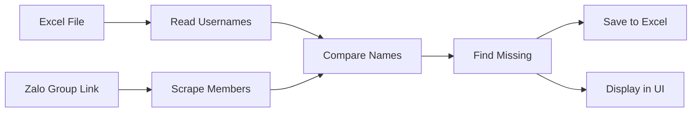

# Zalo Group Membership Checker - Planning Summary

## Project Overview

This project will create a **Python desktop application for macOS** that checks whether Zalo usernames from an Excel file are members of a specified Zalo group.

### Key Features
- ✅ GUI application built with PyQt6
- ✅ Excel file input (.xlsx, .xls)
- ✅ Web automation using Playwright to scrape Zalo group members
- ✅ Fuzzy name matching for flexible comparison
- ✅ Excel/CSV output with missing members
- ✅ Real-time progress tracking
- ✅ Manual login support for Zalo Web

## Technology Stack

| Component | Technology | Purpose |
|-----------|-----------|---------|
| **Language** | Python 3.9+ | Core application |
| **GUI Framework** | PyQt6 | Desktop interface |
| **Web Automation** | Playwright | Scrape Zalo Web |
| **Excel Processing** | openpyxl, pandas | Read/write Excel files |
| **Name Matching** | fuzzywuzzy | Fuzzy string comparison |
| **Platform** | macOS | Primary target platform |

## Project Structure

```
check_group_zalo/
├── src/
│   ├── main.py                    # Application entry point
│   ├── ui/
│   │   └── main_window.py         # Main GUI window
│   ├── scraper/
│   │   ├── zalo_scraper.py        # Zalo web scraper
│   │   └── browser_manager.py    # Browser automation
│   ├── excel/
│   │   ├── reader.py              # Excel file reader
│   │   └── writer.py              # Excel/CSV writer
│   └── core/
│       └── comparator.py          # Name comparison logic
├── plans/
│   ├── project-plan.md            # Detailed project plan
│   ├── technical-architecture.md  # Architecture diagrams
│   ├── implementation-guide.md    # Code examples
│   └── README.md                  # This file
├── requirements.txt               # Python dependencies
└── README.md                      # User documentation
```

## How It Works



## Workflow

1. **User selects Excel file** containing usernames
2. **User enters Zalo group link**
3. **App opens browser** and waits for manual login
4. **App navigates to group** and scrapes all members
5. **App compares** Excel names with group members
6. **App generates output** file with missing members
7. **Results displayed** in UI

## Key Challenges & Solutions

### Challenge 1: Zalo Authentication
**Solution**: Manual login approach - app opens browser, user logs in, then automation continues

### Challenge 2: Dynamic Member Loading
**Solution**: Scroll automation to load all members with smart detection of completion

### Challenge 3: Name Matching Variations
**Solution**: Fuzzy matching algorithm with configurable threshold (85% default)

### Challenge 4: Browser Detection
**Solution**: Playwright with stealth mode and realistic user agent

## Implementation Plan

The project is divided into **25 actionable tasks** organized in 7 phases:

### Phase 1: Project Setup
- Set up Python environment
- Create project structure
- Install dependencies

### Phase 2: Excel Handling
- Implement Excel reader
- Implement Excel writer
- Test with sample data

### Phase 3: UI Development
- Create main window
- Add file selection
- Add progress indicators

### Phase 4: Web Scraping
- Set up Playwright
- Implement login handler
- Create member scraper

### Phase 5: Comparison Logic
- Implement exact matching
- Add fuzzy matching
- Handle edge cases

### Phase 6: Integration
- Connect all modules
- Add error handling
- Generate output

### Phase 7: Testing & Deployment
- Unit testing
- End-to-end testing
- Package for macOS

## Documentation Files

1. **[`project-plan.md`](project-plan.md)** - Comprehensive project plan with requirements, architecture, and development phases
2. **[`technical-architecture.md`](technical-architecture.md)** - Detailed architecture diagrams, class structure, and data flow
3. **[`implementation-guide.md`](implementation-guide.md)** - Code examples and implementation details for each module

## Next Steps

Once you approve this plan, we can:

1. **Switch to Code mode** to begin implementation
2. **Create the project structure** with all necessary files
3. **Implement modules** following the todo list
4. **Test and refine** the application
5. **Package for distribution** on macOS

## Questions to Consider

Before implementation, you may want to clarify:

- **Zalo Web Selectors**: The actual DOM selectors for Zalo Web may need adjustment during implementation
- **Column Name**: Should the app auto-detect the username column or require a specific column name?
- **Output Location**: Should users choose where to save the output file?
- **Matching Threshold**: Should the fuzzy matching threshold (85%) be configurable in the UI?

## Estimated Complexity

- **Project Size**: Medium
- **Technical Difficulty**: Moderate to High (due to web scraping)
- **Main Risks**: 
  - Zalo Web structure changes
  - Anti-automation detection
  - Browser compatibility issues

## Success Criteria

The project will be considered successful when:

- ✅ User can select Excel file and enter group link
- ✅ App successfully scrapes Zalo group members
- ✅ Comparison accurately identifies missing members
- ✅ Output file is generated correctly
- ✅ UI provides clear feedback and progress updates
- ✅ Application runs reliably on macOS
