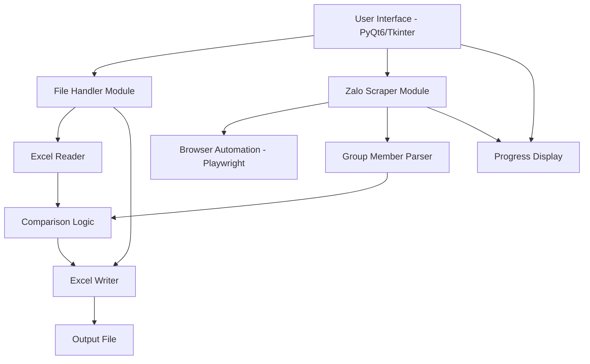

# Zalo Group Membership Checker - Project Plan

## Overview
Build a Python desktop application for macOS that checks if Zalo usernames from an Excel file are members of a specified Zalo group. The app will use web automation (Selenium/Playwright) to access Zalo Web and compare usernames.

## Project Requirements

### Input
- Zalo group link (URL)
- Excel file (.xlsx or .xls) containing a column with Zalo usernames

### Output
- Excel/CSV file containing usernames that are NOT in the group
- Display results in the application UI

### Technology Stack
- **Language**: Python 3.9+
- **GUI Framework**: PyQt6 or Tkinter
- **Web Automation**: Playwright (recommended) or Selenium
- **Excel Processing**: openpyxl, pandas
- **Platform**: macOS (with potential cross-platform compatibility)

## System Architecture



## Key Components

### 1. User Interface Module
- File selection dialog for Excel input
- Text field for Zalo group link input
- Start/Stop buttons for process control
- Progress bar showing scraping progress
- Results display area
- Output file save location selector

### 2. Excel Handler Module
- Read Excel files using openpyxl/pandas
- Parse username column (configurable column name)
- Write results to new Excel/CSV file
- Handle various Excel formats

### 3. Zalo Web Scraper Module
- Initialize Playwright/Selenium browser
- Navigate to Zalo Web
- Handle login authentication (manual or automated)
- Access group via provided link
- Extract member list from group
- Parse member usernames/names

### 4. Comparison Engine
- Compare Excel usernames with group member list
- Generate list of missing members
- Handle name matching (exact, case-insensitive, fuzzy)

### 5. Configuration & Settings
- Browser settings (headless/visible mode)
- Timeout configurations
- Column name mapping
- Output format preferences

## Technical Challenges & Solutions

### Challenge 1: Zalo Authentication
**Problem**: Zalo Web requires login, which may need 2FA or QR code scanning

**Solutions**:
- Option A: Manual login - App opens browser, user logs in manually, then app proceeds
- Option B: Session persistence - Save browser session/cookies for reuse
- Option C: QR code login - Display QR code in app for mobile scanning

### Challenge 2: Dynamic Content Loading
**Problem**: Zalo group member list may load dynamically with infinite scroll

**Solutions**:
- Implement scroll automation to load all members
- Wait for elements to load using explicit waits
- Handle pagination if present

### Challenge 3: Rate Limiting & Detection
**Problem**: Zalo may detect automation and block access

**Solutions**:
- Use stealth mode plugins (playwright-stealth)
- Add random delays between actions
- Use real user agent strings
- Consider running in non-headless mode

### Challenge 4: Name Matching
**Problem**: Usernames in Excel may not exactly match Zalo display names

**Solutions**:
- Implement fuzzy matching using fuzzywuzzy library
- Provide matching threshold configuration
- Allow multiple matching strategies (exact, contains, fuzzy)

## Project Structure

```
check_group_zalo/
├── src/
│   ├── __init__.py
│   ├── main.py                 # Application entry point
│   ├── ui/
│   │   ├── __init__.py
│   │   ├── main_window.py      # Main GUI window
│   │   ├── dialogs.py          # Custom dialogs
│   │   └── styles.py           # UI styling
│   ├── scraper/
│   │   ├── __init__.py
│   │   ├── zalo_scraper.py     # Zalo web scraper
│   │   ├── browser_manager.py # Browser initialization
│   │   └── parser.py           # HTML parsing logic
│   ├── excel/
│   │   ├── __init__.py
│   │   ├── reader.py           # Excel file reader
│   │   └── writer.py           # Excel/CSV writer
│   ├── core/
│   │   ├── __init__.py
│   │   ├── comparator.py       # Username comparison logic
│   │   └── config.py           # Configuration management
│   └── utils/
│       ├── __init__.py
│       ├── logger.py           # Logging utilities
│       └── validators.py       # Input validation
├── tests/
│   ├── test_scraper.py
│   ├── test_excel.py
│   └── test_comparator.py
├── resources/
│   ├── icons/
│   └── sample_data/
│       └── sample_usernames.xlsx
├── plans/
│   └── project-plan.md         # This file
├── requirements.txt
├── README.md
├── .gitignore
└── setup.py
```

## Dependencies

```
playwright==1.40.0
openpyxl==3.1.2
pandas==2.1.4
PyQt6==6.6.1
fuzzywuzzy==0.18.0
python-Levenshtein==0.23.0
playwright-stealth==1.0.0
```

## Development Phases

### Phase 1: Project Setup & Excel Handling
- Set up Python virtual environment
- Install required dependencies
- Create project structure
- Implement Excel reader module
- Implement Excel writer module
- Test with sample data

### Phase 2: Basic UI Development
- Create main window with PyQt6/Tkinter
- Add file selection dialogs
- Add input fields for group link
- Implement basic layout and styling
- Add progress indicators

### Phase 3: Zalo Web Scraper
- Set up Playwright/browser automation
- Implement navigation to Zalo Web
- Handle login flow (manual approach first)
- Extract group URL and navigate to group
- Parse group member list
- Handle dynamic loading and scrolling

### Phase 4: Comparison Logic
- Implement username comparison algorithm
- Add fuzzy matching capability
- Handle edge cases (empty values, special characters)
- Generate missing member list

### Phase 5: Integration & Output
- Connect all modules together
- Implement output file generation
- Add error handling throughout
- Display results in UI

### Phase 6: Testing & Refinement
- Unit testing for each module
- Integration testing
- User acceptance testing
- Performance optimization
- Bug fixes

### Phase 7: Documentation & Deployment
- Write user documentation
- Create README with setup instructions
- Package application (PyInstaller for macOS)
- Create installer if needed

## Security Considerations

1. **Credentials**: Never store Zalo login credentials in code
2. **Session Data**: Store browser sessions securely if persisting
3. **Input Validation**: Validate all user inputs (file paths, URLs)
4. **Error Messages**: Don't expose sensitive information in errors
5. **Dependencies**: Keep libraries updated for security patches

## Future Enhancements

1. **Batch Processing**: Support multiple groups at once
2. **Scheduling**: Periodic automatic checks
3. **Notifications**: Alert when check completes
4. **Export Formats**: JSON, PDF reports
5. **Cloud Storage**: Integration with Google Drive/Dropbox
6. **Member Tracking**: Historical tracking of membership changes
7. **Multi-platform**: Windows and Linux support
