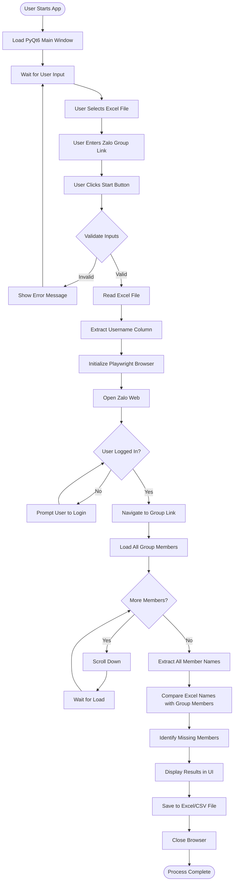
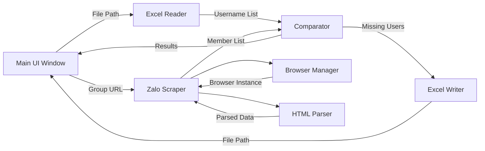
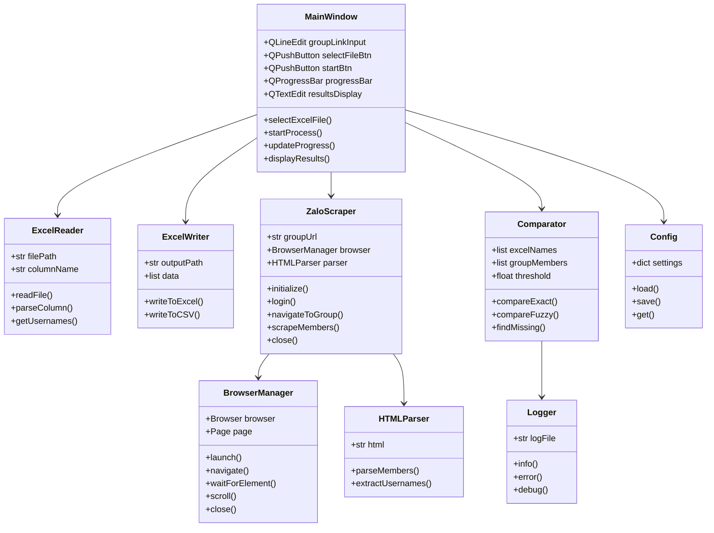
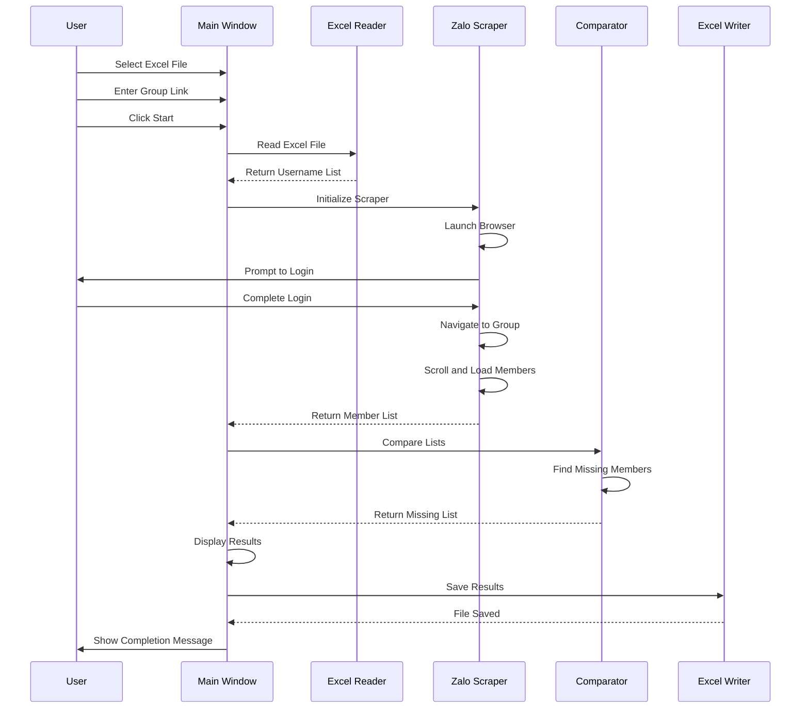

# Zalo Group Membership Checker - Technical Architecture

## Application Flow



## Module Interaction Diagram



## Class Structure



## Data Flow



## Implementation Guidelines

### 1. Excel Reader Module ([`src/excel/reader.py`](src/excel/reader.py))
```python
Key Features:
- Support .xlsx and .xls formats
- Auto-detect username column or allow user to specify
- Handle empty rows and invalid data
- Return clean list of usernames

Libraries: openpyxl, pandas
```

### 2. Zalo Scraper Module ([`src/scraper/zalo_scraper.py`](src/scraper/zalo_scraper.py))
```python
Key Features:
- Playwright browser automation
- Stealth mode to avoid detection
- Handle dynamic content loading
- Scroll automation to load all members
- Extract member names from DOM

Libraries: playwright, playwright-stealth
```

### 3. Comparator Module ([`src/core/comparator.py`](src/core/comparator.py))
```python
Key Features:
- Exact string matching case-insensitive
- Fuzzy matching with configurable threshold
- Handle special characters and whitespace
- Return detailed comparison results

Libraries: fuzzywuzzy, python-Levenshtein
```

### 4. Main UI Module ([`src/ui/main_window.py`](src/ui/main_window.py))
```python
Key Features:
- Clean, intuitive interface
- Real-time progress updates
- Error message display
- Results preview
- Export options

Libraries: PyQt6
```

## Configuration File Structure

```json
{
  "browser": {
    "headless": false,
    "timeout": 30000,
    "viewport": {
      "width": 1280,
      "height": 800
    }
  },
  "scraper": {
    "scroll_pause": 2,
    "max_scroll_attempts": 50,
    "wait_for_element": 10
  },
  "excel": {
    "default_column": "username",
    "output_format": "xlsx"
  },
  "comparison": {
    "method": "fuzzy",
    "threshold": 0.85,
    "case_sensitive": false
  },
  "logging": {
    "level": "INFO",
    "file": "logs/app.log"
  }
}
```

## Error Handling Strategy

### Critical Errors (Stop Execution)
1. Excel file not found or corrupted
2. Invalid Zalo group URL format
3. Browser automation failure
4. No username column found in Excel

### Non-Critical Errors (Log & Continue)
1. Individual username parsing failures
2. Timeout on loading some members
3. Network connectivity issues (retry)

### User Notifications
- File selection errors
- Invalid input format
- Login required prompts
- Scraping progress updates
- Completion status

## Performance Optimization

### Memory Management
- Stream large Excel files
- Process members in batches
- Clear browser cache periodically

### Speed Improvements
- Parallel processing for comparison
- Efficient DOM selectors
- Minimize wait times with smart waits

### Resource Cleanup
- Close browser after completion
- Release file handles
- Clear temporary data

## Testing Strategy

### Unit Tests
- Excel reader with various file formats
- Comparator with edge cases
- Parser with different HTML structures

### Integration Tests
- Full workflow with sample data
- Browser automation scenarios
- Output file generation

### Manual Tests
- UI usability testing
- Real Zalo group testing
- Cross-platform verification

## Deployment Checklist

- [ ] All dependencies installed via requirements.txt
- [ ] Playwright browsers installed
- [ ] Configuration file created
- [ ] Sample data prepared
- [ ] README documentation complete
- [ ] Application tested on macOS
- [ ] PyInstaller spec file created
- [ ] Executable built and tested
- [ ] Installation guide written
